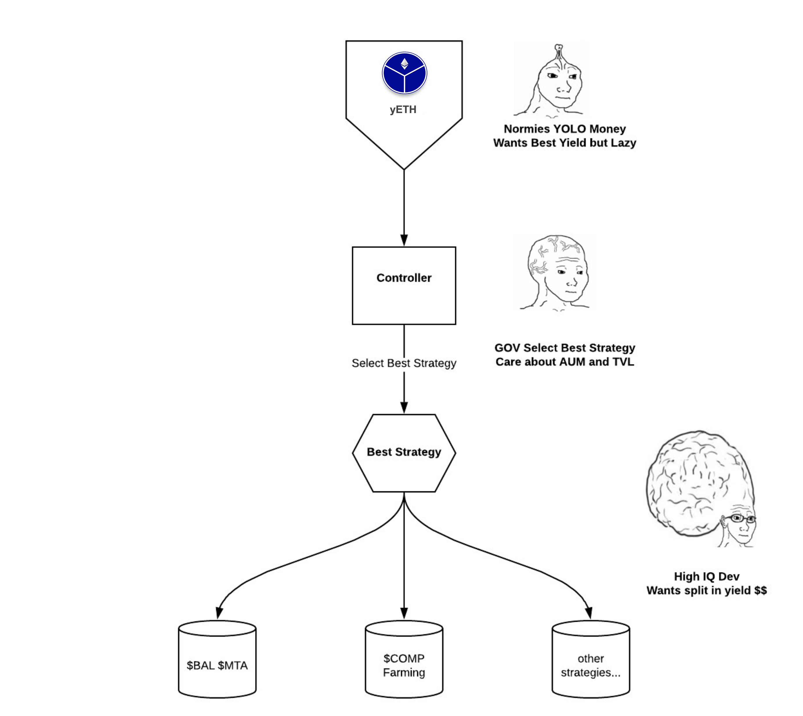

## Yeth

## Overall strcture of yVault

- [yETH vault explained](https://medium.com/iearn/yeth-vault-explained-c29d6b93a371)

## UML digrams

- [Controller.sol.svg](./Controller.sol.svg)
- [StrategyMKRVaultDAIDelegate.sol.svg](./StrategyMKRVaultDAIDelegate.sol.svg)
- [yETH.sol.svg](yETH.sol.svg)

## Flows

### Deposit Eth

- https://bscscan.com/token/0x77dfb1dafc92c5df29996f5528ba1829941cd3bb

### Withdraw all

- https://defiexplore.com/tx/0x20cc464def988f870b8f4f26ed53b000e7d06c818d36bc415e4718de69b1e6e2
- https://bscscan.com/token/0x77dfb1dafc92c5df29996f5528ba1829941cd3bb

### Harvest

- https://defiexplore.com/tx/0x20cc464def988f870b8f4f26ed53b000e7d06c818d36bc415e4718de69b1e6e2
- https://bscscan.com/token/0x77dfb1dafc92c5df29996f5528ba1829941cd3bb

TBA

### ForceRebalance

- https://defiexplore.com/tx/0x20cc464def988f870b8f4f26ed53b000e7d06c818d36bc415e4718de69b1e6e2
- https://bscscan.com/token/0x77dfb1dafc92c5df29996f5528ba1829941cd3bb
