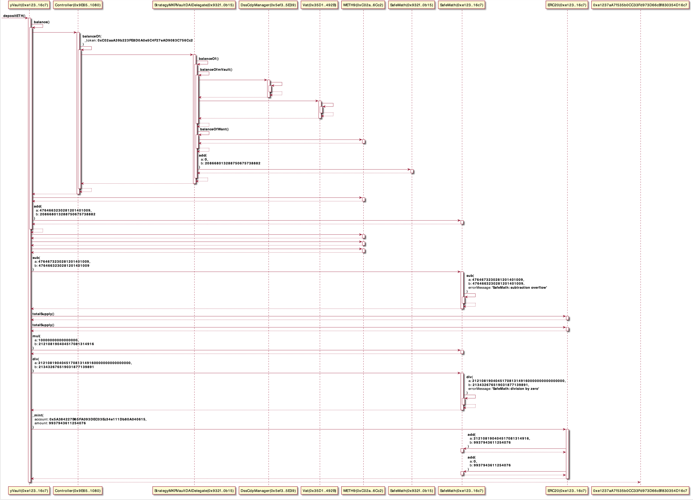
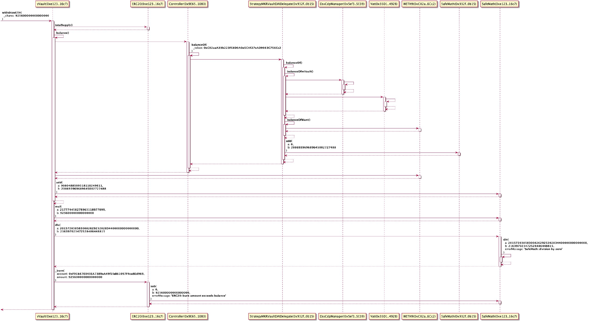

## Yeth

## Overall strcture of yVault

- [yETH vault explained](https://medium.com/iearn/yeth-vault-explained-c29d6b93a371)

## UML digrams

- [Controller.sol.svg](./Controller.sol.svg)
- [StrategyMKRVaultDAIDelegate.sol.svg](./StrategyMKRVaultDAIDelegate.sol.svg)
- [yVault.sol.svg](yVault.sol.svg)

## Flows

### Deposit Eth

- https://etherscan.io/tx/0x20cc464def988f870b8f4f26ed53b000e7d06c818d36bc415e4718de69b1e6e2

### Withdraw all

- https://defiexplore.com/tx/0x20cc464def988f870b8f4f26ed53b000e7d06c818d36bc415e4718de69b1e6e2
- https://etherscan.io/tx/0x20cc464def988f870b8f4f26ed53b000e7d06c818d36bc415e4718de69b1e6e2

### Harvest

- https://defiexplore.com/tx/0x20cc464def988f870b8f4f26ed53b000e7d06c818d36bc415e4718de69b1e6e2
- https://etherscan.io/tx/0x20cc464def988f870b8f4f26ed53b000e7d06c818d36bc415e4718de69b1e6e2

TBA

### ForceRebalance

- https://defiexplore.com/tx/0x20cc464def988f870b8f4f26ed53b000e7d06c818d36bc415e4718de69b1e6e2
- https://etherscan.io/tx/0x20cc464def988f870b8f4f26ed53b000e7d06c818d36bc415e4718de69b1e6e2

TBA

## Open Questions.

- How does it autmatically rebalance when Eth price changes?
- Currently [$17M USD](https://defiexplore.com/cdp/13972) worth of DAI are minted while there are only [$13M USD](https://www.curve.fi/iearn/) worth of DAI in Curve. What happens when it tries to rebalance when Eth price crashes and there isn't enough DAI in Curve?
- Where is 60M cap mentioned in the blog post?